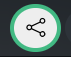

Sharing your music with others is easy in Mix That!

To share a track, simply click the share icon:

## Account Features

- You can change a track's public/private status at any time in the track settings
- Remember, while the track is "public", sharing a link means anyone with the URL can access your track
- [Upgrade your plan](/docs/other/sponsor-this-project/) to unlock extended sharing options

## Extended Share Options

For [sponsors](/docs/other/sponsor-this-project/), Mix That offers advanced sharing capabilities that provide greater control and functionality:

### Extended Share Expiry

By default, share links expire after 3 days for security purposes. However, sponsors have additional options:

- **Extended expiry periods**: Choose longer expiration times for your share links
- **Indefinite sharing**: Set links to never expire for permanent sharing needs
- **Flexible control**: Change expiry settings based on your specific sharing requirements

### Allow Creation of Mix to Users

When source audio is stored for all stems in your track (available to sponsors), you can enable recipients to:

- **Generate custom mixes**: Share link users can create their own mix versions
- **Interactive experience**: Recipients can adjust stem levels and create personalized versions
- **Enhanced collaboration**: Perfect for sharing works-in-progress with collaborators

### Allow Downloading of Source Audio

This option allows recipients of the share link to:

- **Download individual stems**: Access source audio for any stem that has it available
- **Professional collaboration**: Share high-quality audio files with other producers or musicians
- **Remix capabilities**: Enable others to use your stems in their own projects

### Managing Your Share Links

Mix That provides a comprehensive interface to manage all your active share links in one place:

#### Accessing Share Management

Click **"Manage Tokens"** when creating a share link to access the Share Management interface.

#### Key Features

- **View All Shares**: See all your active share links organized in a clean table with creation dates, expiration times, and permissions
- **Name Your Shares**: Add custom names to help identify who you shared with or what the link is for (e.g., "Client Demo", "Blog Post", "John Smith")
- **Track Usage**: Monitor when each share link was last accessed to understand engagement
- **Quick Deletion**: Remove share links instantly to revoke access immediately
- **Pagination**: Easily browse through all your shares, even if you have many

This feature gives you complete control and transparency over your shared content, making it easy to manage who has access to your tracks and for how long.

## Creating a Share

After selecting your desired options:

1. Click **"Create Share"** to generate your customized share link
2. **Copy the share link**: Direct URL that can be shared via email, messaging, or social media
3. **Copy the embed code**: HTML code for embedding the player directly in websites

## Using Embed Code

The embed code can be pasted into:

- **Your website**: Add the Mix That player directly to your site
- **Content management systems**: WordPress, Squarespace, and other CMS platforms
- **Blog posts and articles**: Embed interactive audio content

**Important for embeds**: For persistent embeds that remain functional long-term, ensure the expiry time is set to indefinite. This prevents the embed code from breaking when the share link expires.

Look here for more info on [embedding](/docs/general/embedding-a-player)

Enjoy sharing your music, and let us know if you have any questions or need help with sharing options!
