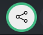

Sharing your music with others is easy in Mix That!

To share a track, simply click the share icon:

- **Private Tracks:** If your track is not marked as [public](/docs/guides/upload-tracks/#public-access--quality), a secure, time-limited URL will be generated. This link grants access to your track for 30 days, making it perfect for sharing with select collaborators or friends.

- **Public Tracks:** If your track is marked as [public](/docs/guides/upload-tracks/#public-access--quality), a public URL will be generated. This link remains valid as long as the track is public, allowing anyone with the link to listen without logging in.

You can change a track's public/private status at any time in the track settings. Remember, sharing a public link means anyone with the URL can access your track.

Enjoy sharing your music, and let us know if you have any questions or need help with sharing options!
